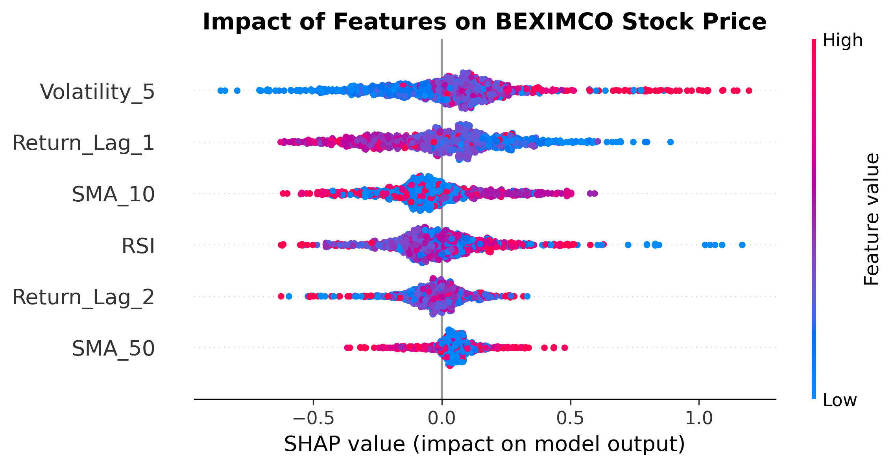
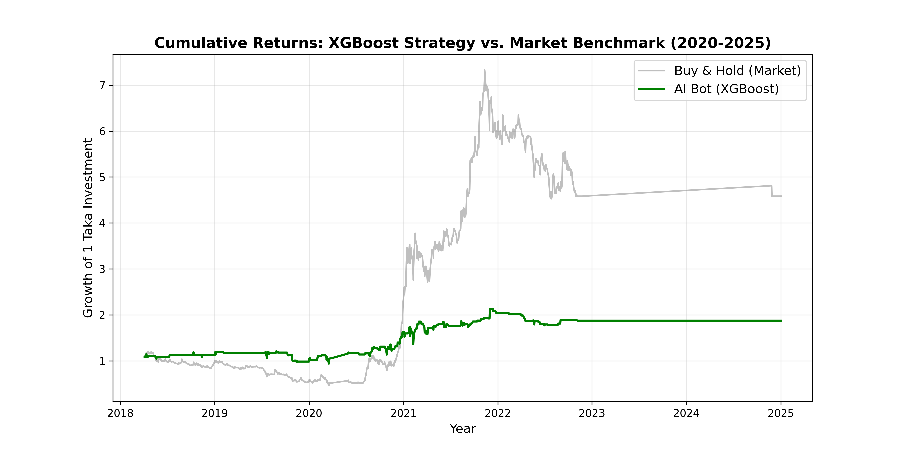

# Beyond Accuracy: An Explainable AI Approach to DSE Market Prediction

### 📄 Research Abstract
This project investigates the predictability of the Dhaka Stock Exchange (DSE) using **XGBoost** and **SHAP (Explainable AI)**. By analyzing 25 years of data (2000–2025) for **BEXIMCO Ltd**, we found that while the market is inefficient, an AI-driven strategy offers superior **capital preservation** during market crashes compared to a standard Buy-and-Hold strategy.

**Key Findings:**
* **Model Accuracy:** 56.16% (Recall: 23% on profitable trades).
* **Risk Management:** The AI model avoided the 2022-2023 crash, reducing drawdown significantly.
* **Drivers:** SHAP analysis reveals that **Momentum (Lagged Returns)** and **RSI** are the primary drivers of DSE volatility.

### 📊 Key Visualizations
**Figure 1: What drives the market? (SHAP Analysis)**

**Figure 2: Man vs. Machine (ROI Backtest)**

### 🛠️ Tools Used
* **Python:** Pandas, NumPy
* **Machine Learning:** XGBoost, Scikit-Learn
* **Explainability:** SHAP
* **Visualization:** Matplotlib, Seaborn

### 📂 Files in this Repo
1.  `DSE_Market_Prediction_Model.ipynb`: The complete Python code for data cleaning, training, and backtesting.
2.  `Research_Paper.pdf`: The full academic paper detailing the methodology and financial analysis.
